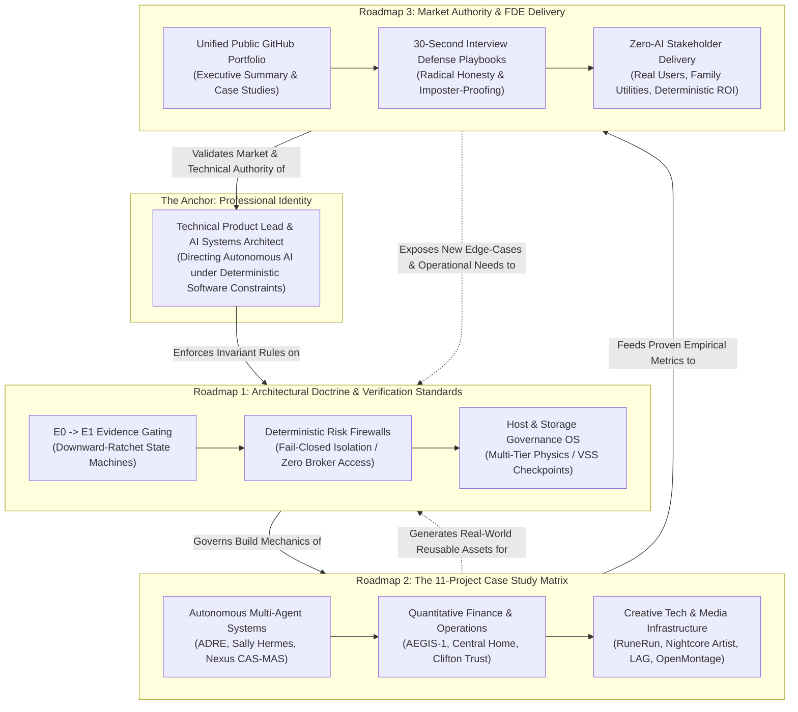

# The Master Executive Architecture Roadmap
### *3 Intertwined Looping Roadmaps: Doctrine, Execution, and Market Authority*

---

### Executive Leadership Metadata
* **Architect & Technical Product Lead:** Andrew Clifton
* **Professional Focus:** AI Systems Architecture, Deterministic Software Constraints, and Forward Deployed Engineering (FDE)
* **Master Portfolio Link:** [https://github.com/cadecom101-sketch/andrew-clifton-portfolio](https://github.com/cadecom101-sketch/andrew-clifton-portfolio)
* **Home Base Orchestrator:** `D:\projects\tools\hb.py` | `D:\projects\.homebase\registry.json`
* **Status:** **ACTIVE ROADMAP CHARTER**

---

## 1. Executive Summary & The 3-Loop Architecture

This roadmap formalizes the strategic feedback loops that connect Andrew Clifton's **Professional Identity**, his **Architectural Doctrine**, his **11 Production Case Studies**, and his **Market Authority**.

Rather than treating learning, project building, and career positioning as disconnected linear tracks, this framework models them as **three continuous, intertwining loops that feed back into each other**:



---

## 2. Roadmap 1: Architectural Doctrine & Verification Standards (The Rulebook)

> [!IMPORTANT]
> **Core Doctrine Invariant:** Non-deterministic LLMs handle unstructured ingestion, creative synthesis, and draft proposals. Deterministic code (Python, PostgreSQL, SQLite, Pydantic, Shell) enforces all schemas, risk limits, state transitions, and file mutations.

### Key Pillars:
1. **The Downward-Ratchet State Machine (ADRE Doctrine):**
   - Systems start at a strict baseline score and can only be ratcheted *down* by hard evidence gates ($E_0 \rightarrow E_1$).
   - Models are mathematically prevented from rationalizing false "BUILD" or false "TRADE" decisions.
2. **The External Fail-Closed Risk Firewall (AEGIS-1 Doctrine):**
   - Agents possess zero direct execution credentials to capital, live brokers, or critical production databases.
   - All proposed actions must pass through an out-of-band deterministic firewall enforcing drawdown clamps, position limits, and dual-sealed confirmation gates.
3. **Multi-Tier Physical Host Governance (Storage OS Doctrine):**
   - Respecting storage physics: Low-latency NVMe solid-state bandwidth is preserved exclusively for OS execution and hot VM sandboxes. Cold, write-once download artifacts and logs route strictly to high-capacity mechanical storage.
   - Zero destructive operations run without an authenticated Volume Shadow Copy (VSS) checkpoint.

---

## 3. Roadmap 2: The 11-Project Case Study Matrix (The Execution Engine)

This roadmap organizes the entire production footprint of Andrew's workstation into three distinct engineering disciplines:

| Domain | Flagship Projects | Verified Architecture Mechanics |
|---|---|---|
| **Autonomous Multi-Agent Systems** | • **ADRE (Demand Research)**<br>• **NEXUS CAS-MAS**<br>• **MAS Sally Hermes OS** | 5-phase evidence gating; Pydantic schema validation; MinHash/Jaccard mathematical deduplication ($>0.70$ threshold); two-phase deployment approval packets with $<10$s rollback manifests. |
| **Games & Creative Technology** | • **RuneRun (Version 14)**<br>• **Nightcore Artist Project**<br>• **Losing Against Ghosts**<br>• **OpenMontage Video Engine** | 161/161-assertion automated test suite; dual-assistant peer verification (Claude synthesizes, Codex audits); procedural Web Audio; declarative Remotion React video generation. |
| **Finance, Risk & Operations** | • **AEGIS-1 Quantitative Trader**<br>• **Self-Storage Underwriting**<br>• **Central Home Properties OS**<br>• **Host QoS Network Optimization** | ADR-0001/0002 risk firewalls; 250-intent confirmation studies; local legal RAG pipelines; Section 8 SOP automation; router bufferbloat mitigation runbooks. |

---

## 4. Roadmap 3: Market Authority & FDE Delivery (The Career Engine)

> [!TIP]
> **Market Position:** Forward Deployed Engineer (FDE) / AI Solutions Architect / Technical Product Lead.
> **The Narrative:** Not an academic researcher or a naive prompt engineer—a Systems Architect who directs autonomous agents under strict software constraints to deliver measurable, hallucination-free business ROI.

### Strategic Artifacts & Channels:
1. **Unified Public GitHub Showcase:**
   - Live repository: `https://github.com/cadecom101-sketch/andrew-clifton-portfolio`
   - Master Executive Summary with clean Markdown links to all 11 individual public case studies.
2. **The 30-Second Interview Defense Playbooks:**
   - Private, imposter-proof playbooks for every project.
   - Structured around: *What was your exact role? Why use evidence gates? What was the hardest failure? How do you prevent hallucinations?*
3. **Real-World Stakeholder Validation:**
   - Proving that systems work not just for technical evaluators, but for non-technical end-users who use zero AI.

---

## 5. The Intertwining Loops: How the System Self-Reinforces

```
                 LOOP 1: DOCTRINE ──► EXECUTION
         [ Architectural Rules ] ──► [ 11 Project Showcases ]
         (E0->E1, Firewalls, VSS)     (Empirical Codebases)
                    ▲                         │
                    │                         ▼
         [ Continual Evolution ]    LOOP 2: EXECUTION ──► AUTHORITY
         (Lessons, Hardening)       [ Proof & Defense Guides ]
                    ▲                         │
                    │                         ▼
                    └─── LOOP 3: AUTHORITY ──► IDENTITY
                         [ Market Recognition & FDE Authority ]
```

* **Loop 1 (Doctrine → Execution):** The architectural rules dictate how every project is built. No project is started without clear gates and error traps.
* **Loop 2 (Execution → Authority):** Real project metrics (161 test assertions, +15.57 GB storage recovery, $0 capital loss) feed directly into the Master Executive Summary and GitHub case studies, providing undeniable proof of competence.
* **Loop 3 (Authority → Identity & Evolution):** Deploying systems into the real world exposes edge-cases (e.g., discovering multi-user AppX boundaries, unmanaged pagefile growth), which loop back to refine the architectural doctrine for all future projects.

---

## 6. Strict Governance & Boundaries for Upcoming Activity

### 🎯 Dedicated Build Activity: Simple ≤1-Hour Programs for Dad & Brother

To maintain total system cleanliness and protect existing creative assets, the following operational boundaries are **PERMANENTLY LOCKED**:

```text
========================================================================================
OPERATIONAL SAFETY BOUNDARIES: FAMILY MICRO-PROGRAMS SPRINT
========================================================================================
1. PHYSICAL LOCATION:
   └── Must reside strictly in a clean subfolder:
       C:\Users\cadec\Desktop\Andrew's Creative Projects\family-utilities\
       (or \micro-tools\)

2. STRICT WORK BOUNDARY:
   ├── The agent is ONLY permitted to create and modify files INSIDE this dedicated subfolder.
   └── NEVER touch or alter ANY file in the parent folder or any sibling directory.

3. SACRED ASSET PROTECTION (LOCKED):
   └── ⛔ NEVER TOUCH ANYTHING ABOUT THE GAME (RuneRun).
       - RuneRun Version 14 is frozen, tested, and complete.
       - No modifications to index.html, runerun/, tools/, or docs/.

4. ONLY ALLOWED EXTERNAL ACTION:
   └── If external updates are required, the agent is ONLY allowed to update Andrew's 
       personal website/portfolio in plain, simple terms with ZERO technical jargon.

5. HOME BASE SYNCHRONIZATION:
   └── Home Base tracks the new micro-suite non-invasively via:
       python D:\projects\tools\hb.py link "C:\Users\cadec\Desktop\Andrew's Creative Projects\family-utilities" --name "Family-Micro-Utilities" --type "utility"
========================================================================================
```

---
*This Master Roadmap is canonically tracked in Home Base (`D:\projects\.homebase\registry.json`) and synchronized with the Master Executive Summary.*
