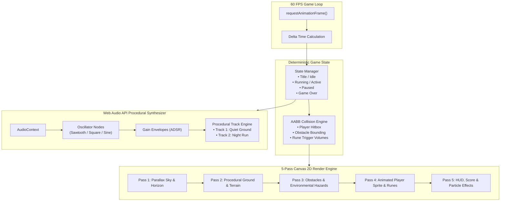

# RuneRun — Browser Action Game & Procedural Web Audio Engine
### *A Zero-Dependency Canvas 2D Game Reaching Version 14 Under Multi-Assistant Architectural Governance*

[](#version-14-milestone--current-state)
[](#andrews-role--radical-transparency)
[](#engineering-rigor--verification)
[](#procedural-audio-engine)
[](#technical-architecture)

---

## Executive Summary

**RuneRun** is a high-performance, zero-dependency browser action game engineered to prove that rapid AI-assisted development can produce polished, production-grade software without architectural rot.

Directed and governed by **Andrew Clifton**, RuneRun evolved across 14 disciplined release versions to feature a custom 5-pass Canvas 2D rendering pipeline, an algorithmic Web Audio synthesizer playing original multi-track procedural compositions (`Quiet Ground` and `Night Run`), collision detection, and a comprehensive **161-assertion Python verification suite**.

Rather than letting AI assistants inject chaotic code patches, Andrew instituted a strict **dual-assistant governance model** (Claude and Codex operating under mutual verification) where assistants remain strictly read-only until Andrew issues explicit cryptographic and verbal authorization gates.

```
                           THE RUNERUN EQUATION
  Zero-Dependency Canvas ──► [ Multi-Assistant Governance ] ──► Version 14 Shipped
  • Pure HTML5 / JS          • 161 Automated Checks             ═════════════════════════
  • Procedural Web Audio     • Claude/Codex Peer Review         Instant 60 FPS Browser Play
  • 5-Pass Render Engine     • Andrew's Authorization Gate      With Zero External Libraries
```

---

## The Engineering Problem: The "AI Prototype Trap" & Code Decay

Most AI-generated games and web applications collapse into unmaintainable spaghetti code after Version 2 or 3:
1. **The Patchwork Paradox:** Uncontrolled LLMs patch new features by injecting conflicting globals, duplicating state, and hallucinating obsolete variables.
2. **Framework Bloat:** Developers reflexively import heavy game engines (Phaser, Three.js, React) for simple 2D mechanics, creating massive bundle sizes, loading delays, and dependency security risks.
3. **Audio Desynchronization:** Audio in web games is typically handled via static MP3 files that suffer from latency, large asset downloads, and mobile autoplay blocking.
4. **Verification Blindness:** Without automated regression testing, fixing a collision glitch in an action game silently breaks score tracking or audio triggers.

> [!IMPORTANT]
> **Core Architectural Axiom:**  
> *A project is only as advanced as its state machine and verification harness.*  
> By keeping RuneRun strictly zero-dependency (Vanilla JS + HTML5 Canvas) and binding every commit to an automated 161-test Python suite, Andrew proved that AI-assisted velocity can achieve enterprise-grade software stability.

---

## Andrew's Role & Radical Transparency

This showcase demonstrates **Technical Product Leadership, Software Governance, and AI Direction**:

```
┌─────────────────────────────────────────────────────────────────────────────┐
│                      ANDREW CLIFTON — ARCHITECT & DIRECTOR                  │
├─────────────────────────────────────────────────────────────────────────────┤
│  • System Governance: Instituted dual-assistant mutual verification gates.  │
│  • Release Authority: Sole authorization holder for git commit promotion.   │
│  • Test Architecture: Specified 161 test assertions across mechanics/audio. │
│  • Game Mechanics Design: Engineered 5-pass rendering & collision rules.   │
│  • Creative Audio Direction: Directed procedural Web Audio composition.     │
└─────────────────────────────────────────────────────────────────────────────┘
```

### What Andrew Did (The Technical Leadership):
* **Established Mutual Assistant Governance:** Paired Claude (generative synthesis and feature implementation) with Codex (adversarial code audits and test writing). One assistant was never permitted to verify its own work.
* **Locked Authorization Gates:** Mandated that no assistant could touch the working tree or initiate milestone refactors (e.g., *Milestone 1: Split rules from rendering*) without Andrew's exact verbal authorization command.
* **Engineered Deployment Pinning:** Designed the production release workflow where the public share pin remains frozen to a verified build until manually tested and advanced by Andrew, preventing broken builds from reaching players.

### What AI Executed:
* Mathematical matrix calculations for Canvas 2D collision boxes and parallax scrolling.
* Low-level Web Audio API oscillator scheduling, envelope ADSR curve generation, and frequency node routing.
* Execution of the 161-test suite via headless parsing and DOM simulation.

---

## Technical Architecture

RuneRun runs on a clean single-file runtime (`runerun/index.html`) requiring **zero build steps, zero node_modules, and zero external CDNs**.



---

## Procedural Web Audio Engine

Instead of bundling multi-megabyte audio files, RuneRun uses the native browser **Web Audio API** to generate music and sound effects entirely through code:
* **Zero Bandwidth Overhead:** 100% of audio code takes up less than 15 KB of JavaScript.
* **Dynamic Synthesis:** Notes are scheduled dynamically using `AudioContext.currentTime`, preventing audio stuttering even during heavy frame drops.
* **Dual Track Repertoire:**
  * `Quiet Ground`: Atmospheric, minor-key ambient track using softened triangle waves and low-pass filtering.
  * `Night Run`: Fast-paced, arpeggiated pulse track using syncopated square waves for high-intensity action gameplay.

---

## Engineering Rigor & Verification

Every single build of RuneRun is validated by `tools/test.py`, a dedicated Python test suite that parses the HTML/JS AST, validates game constants, and tests gameplay mechanics before any build is tagged.

```
========================= TEST RUNNER TELEMETRY =========================
Test Suite:       tools/test.py
Target File:      runerun/index.html
Verification:     161/161 passed (100%)
Skipped Sections: None
SHA256:           08f3bd188500e7f528d68598bf081947956dd8416b6897d3e71fefec9680532a
Git Commit Blob:  5ac50b959809dd1d6195e5c4b1cb3b9384765dc7
Exit Code:        0 (CLEAN)
=========================================================================
```

### Verified Test Areas:
1. **Canvas Initialization:** Dimensions, aspect ratio preservation, high-DPI retina display scaling.
2. **Input Handling:** Keyboard event listeners (`ArrowUp`, `Space`), touch swipe bindings, focus loss auto-pausing.
3. **Collision Precision:** Axis-Aligned Bounding Box (AABB) math, corner clipping prevention, velocity clamping.
4. **Audio Engine Integrity:** Frequency arrays, note duration arrays, oscillator lifecycle garbage collection.
5. **State Transitions:** Clean reset on game over without memory leaks or runaway animation frames.

---

## Key Takeaways & Lessons for Technical Teams

1. **AI Without Guardrails Creates Slop; AI Under Governance Ships Version 14:** Most engineers fail with AI because they accept the first output. Andrew enforced peer review between competing models, requiring Codex to audit Claude's code.
2. **Zero-Dependency Architecture Wins on Longevity:** By eschewing npm packages, RuneRun has zero vulnerable dependencies, requires no bundlers (Webpack/Vite), and will run without modification in web browsers 10 years from now.
3. **Verification Must Precede Refactoring:** Milestone 1 (separating rules from rendering) was strictly blocked until 161 tests were green. You cannot safely refactor code you cannot test.
