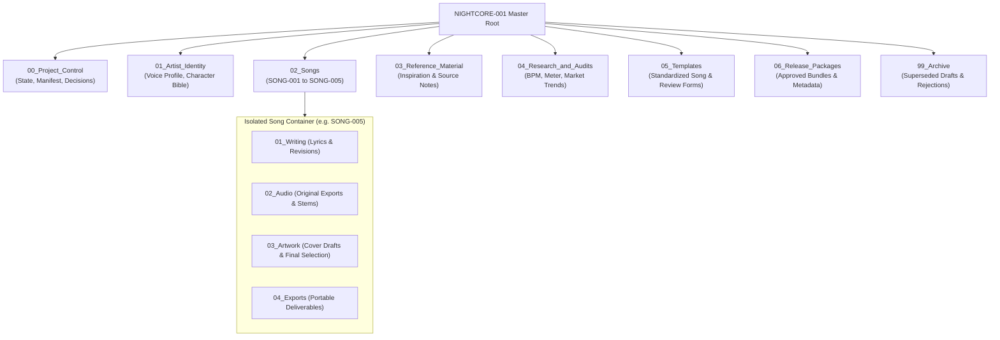

# Nightcore Artist Project (NIGHTCORE-001)
### *A Commercial Creative Operations System & Generative Audio IP Pipeline*

[](#folder-architecture--governance)
[](#andrews-role--radical-transparency)
[](#song-lifecycle--production-pipeline)
[](#generative-audio--visual-ip-engine)
[](#durable-manifest--asset-preservation)

---

## Executive Summary

The **Nightcore Artist Project (`NIGHTCORE-001`)** is an enterprise-grade creative operations framework designed to solve the primary failure point in generative entertainment: **creative inconsistency, asset drift, and chaotic file management.**

Conceived, architected, and directed by **Andrew Clifton**, `NIGHTCORE-001` treats commercial music production not as a series of random AI prompts, but as a **reproducible, version-controlled IP assembly line**. The system produces early-2000s-inspired bubblegum dance-pop and Eurodance tracks featuring a distinct, recognizable adult female nightcore voice profile paired with a recurring illustrated anime-style character IP.

Managing 5 fully developed song packages (`SONG-001` to `SONG-005 That Was Terrible`), the pipeline enforces strict prompt token budgets (<1,000 characters for Suno styles), immutable audio stem versioning, visual character consistency bibles, and a cryptographic **Drive Asset Manifest** that prevents AI assistants from hallucinating or overwriting canonical master recordings.

```
                         THE NIGHTCORE-001 PIPELINE
  Concept / Emotion ──► [ Governed Generation ] ──► Release Package & Assets
  • Style (<1000 chars)  • Suno Audio Generation     ═══════════════════════════
  • Character Bible      • Multi-Pass Listening      Commercial-Ready Digital IP
  • Exact Lyrics         • Asset Hash Verification   With Complete Brand Cohesion
```

---

## The Creative Engineering Problem: Generative Drift & Context Collapse

Modern generative media tools (Suno, Midjourney, Udio) make raw asset creation trivially easy, but building a **sustainable, commercial digital artist** is extraordinarily difficult:
1. **Voice & Style Drift:** Without strict style constraints, music models drift unpredictably in key, tempo, vocal gender, and era from one generation to the next.
2. **Visual Inconsistency:** Character artwork generated across multiple sessions suffers from "prompt dementia"—facial features, hair length, eye color, and art styles change randomly.
3. **Context Loss & Overwritten Masters:** In multi-week productions, developers and assistants frequently confuse rough draft exports with approved masters, leading to accidental data loss.
4. **The "AI Slop" Trap:** Flooding platforms with low-effort, uncurated AI audio destroys audience trust and triggers platform spam suppression.

> [!IMPORTANT]
> **Core Architectural Axiom:**  
> *Generative tools are unpredictable; the operating container must be deterministic.*  
> By separating creative exploration from immutable asset storage, `NIGHTCORE-001` ensures that every generation is cataloged with its exact prompt receipt, seed settings, duration, and cryptographic hash.

---

## Andrew's Role & Radical Transparency

This showcase demonstrates **Creative Direction, Generative AI Workflow Architecture, and Digital Rights Pipeline Management**:

```
┌─────────────────────────────────────────────────────────────────────────────┐
│                      ANDREW CLIFTON — CREATIVE DIRECTOR                     │
├─────────────────────────────────────────────────────────────────────────────┤
│  • IP Architecture: Established the artist constitution & character bible.  │
│  • Audio Engineering: Directed Suno audio models under strict token limits. │
│  • Quality Curation: Enforced human-in-the-loop listening & scoring gates. │
│  • Asset Governance: Built cryptographic manifest tracking across storage.  │
│  • Brand Boundary: Strictly quarantined pop IP from rock catalog (LAG).     │
└─────────────────────────────────────────────────────────────────────────────┘
```

### What Andrew Did (The Technical Leadership):
* **Designed the 8-Tier Folder Architecture:** Structured an immutable project hierarchy (`00_Project_Control` through `06_Release_Packages`) where stable song IDs never change even if song titles are modified.
* **Authored the Creative Constitution:** Defined the vocal timbre boundaries (high-energy, slightly pitched, non-nasal, crisp diction) and lyrical themes to prevent vocal drift across releases.
* **Instituted the <1,000 Character Style Constraint:** Engineered dense, comma-separated musical descriptors tailored to Suno's transformer architecture to maximize stylistic accuracy.
* **Governed Asset Integrity:** Built `DRIVE_ASSET_MANIFEST.json` to link local files to durable cloud drive file IDs and source-file SHA hashes, completely eliminating "hallucinated file recovery."

### What Modern AI Executed:
* Generative audio synthesis (harmonic progression, rhythm, and vocal synthesis) via Suno models.
* Rapid iterative draft lyric rhyming schemes and meter analysis.
* Midjourney / generative image diffusion for song-specific cover scenes based on the character reference sheet.

---

## Folder Architecture & Governance

`NIGHTCORE-001` uses a standardized, modular filesystem layout that scales cleanly across dozens of releases:



---

## Song Lifecycle & Production Pipeline

Every track advances through a strict 8-step quality gate:

1. **Emotional Hypothesis & Hook Selection:** Select emotional material and target groove; check against existing catalog to prevent rhythmic repetition.
2. **Lyric & Style Formulation:** Draft complete lyrics and compose a dense style prompt strictly under 1,000 characters. Target ~3:30 duration.
3. **Generation & Parameter Capture:** Execute generation in Suno; record exact model version, prompt string, persona settings, and audio link.
4. **Export Verification:** Download WAV/MP3 masters into `02_Audio/`; verify sample rate, channel separation, and duration.
5. **Human-in-the-Loop Listening Audit:** Score the track on vocal clarity, chorus payoff, and mix balance; log feedback in structured templates.
6. **Character-Grounded Cover Generation:** Generate cover art using the canonical character visual reference sheet placed in the song's thematic scene.
7. **Package Assembly:** Bundle lyrics, masters, cover art, and metadata into portable release containers.
8. **Manifest Sync:** Compute file hashes, update `DRIVE_ASSET_MANIFEST.json`, and commit project state.

---

## Durable Manifest & Asset Preservation

To protect against conversational hallucinations, `DRIVE_ASSET_MANIFEST.json` acts as the single source of truth:

```json
{
  "project_id": "NIGHTCORE-001",
  "version": "1.0",
  "assets": {
    "SONG-005": {
      "title": "That Was Terrible",
      "working_path": "02_Songs/SONG-005_That_Was_Terrible",
      "audio_master": {
        "filename": "SONG-005_G01_A_Original.wav",
        "sha256": "3a7b9c1e4f...",
        "drive_id": "1aLV8zQd-KITRGQRzb-Gn1_YJ3v1z666t",
        "verified": true
      },
      "cover_art": {
        "filename": "SONG-005_Cover_v01.png",
        "character_reference_verified": true
      }
    }
  }
}
```

---

## Key Takeaways & Lessons for Technical Teams

1. **Digital IP Requires Deterministic Frameworks:** High-volume creative AI without rigid folder conventions and manifests results in complete asset chaos within 48 hours.
2. **Constrained Prompting Outperforms Free-Form Text:** Suno's transformer models respond with far higher fidelity when prompt budgets are capped at 1,000 characters and structured with technical musical descriptors rather than poetic prose.
3. **Separation of Artist Constitutions:** Andrew strictly separated `NIGHTCORE-001` from his alternative rock project (`Losing Against Ghosts`), ensuring that brand identities, audience expectations, and sonic palettes never cross-contaminate.
