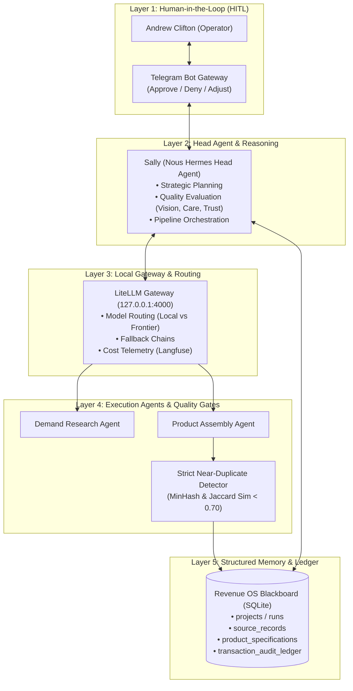

# MAS_SALLY_HERMES — Autonomous Revenue OS & Governed Multi-Agent Architecture
### *An Enterprise-Grade Complex Adaptive System (CAS-MAS-HITL) with LiteLLM Gateway, SQLite Blackboard & Strict Deduplication Gates*

[](#multi-agent-system-architecture)
[](#andrews-role--radical-transparency)
[-brightgreen.svg)](#the-governed-spine--b0-checkpoint)
[](#revenue-os-blackboard-schema)
[](#near-duplicate-detection--quality-defense)

---

## Executive Summary

**MAS_SALLY_HERMES** is an enterprise-grade autonomous business operations engine architected by **Andrew Clifton**. Designed as a **Complex Adaptive System + Multi-Agent System + Human-in-the-Loop (CAS-MAS-HITL)** framework, the project operationalizes autonomous digital commerce while solving the primary risks of multi-agent execution: **runaway API costs, hallucinated product viability, and repetitive "AI slop" spam**.

Running on a 5-layer architecture, MAS_SALLY_HERMES pairs a specialized **Nous Hermes** reasoning agent (`Sally`) with a local **LiteLLM model gateway**, an immutable **SQLite blackboard database (`Revenue OS`)**, and **Langfuse cost telemetry**.

To ensure commercial viablity and legal platform compliance (Etsy, Gumroad, Shopify), Andrew formulated **Strategy v2 ("The Governed Production Line")**: human-anchored authorship and demand validation at the core, wrapped in automated discovery, asset generation, and listing execution. The system features programmatic **Near-Duplicate MinHash deduplication**, token budget routing, and Telegram-based Human-in-the-Loop approve/deny/adjust gates.

```
                     MAS_SALLY_HERMES OPERATIONAL LOOP
  Human Operator (Telegram) ──► [ Sally / Hermes Gateway ] ──► LiteLLM Router (Local:4000)
             ▲                                ▲                           │
             │ (Approve / Deny / Adjust)      │                           ▼
  Deterministic Code Gates ◄── [ Revenue OS Blackboard ] ◄── Execution Agents (Etsy/Gumroad)
  (MinHash Dedup + Telemetry)        (SQLite Schema)
```

---

## The Business & Systems Challenge: The Autonomous Agent Mirage

In 2024–2026, thousands of developers attempted to build "autonomous money-making agents." Virtually all of them failed due to three critical architectural flaws:
1. **The Autonomous Slop Trap:** Unregulated agents flood marketplaces with thousands of low-quality, derivative digital products, resulting in instant platform bans and zero customer sales.
2. **Context Window Amnesia:** Multi-agent swarms passing messages in shared chat context rapidly exhaust context windows, hallucinate past decisions, and loop in infinite conversation cycles.
3. **Runaway Cost Telemetry:** Without local routing and budget caps, autonomous agents invoking frontier LLMs burn hundreds of dollars per day in recursive loops without producing revenue.

> [!IMPORTANT]
> **Core Architectural Axiom:**  
> *Autonomous agents must not govern themselves.*  
> In MAS_SALLY_HERMES, agents propose actions, but state transitions, deduplication verification, financial accounting, and live platform submissions are enforced by a **deterministic SQLite blackboard and human authorization**.

---

## Andrew's Role & Radical Transparency

This showcase highlights senior-level **Multi-Agent Systems Architecture, Operational Governance, and Complex Systems Design**:

```
┌─────────────────────────────────────────────────────────────────────────────┐
│                      ANDREW CLIFTON — ARCHITECT & LEAD                      │
├─────────────────────────────────────────────────────────────────────────────┤
│  • System Architecture: Designed the 5-layer CAS-MAS-HITL operational model. │
│  • Governance Strategy: Authored Strategy v2 Governed Production Line.      │
│  • Blackboard Design: Structured 22KB SQLite Revenue OS schema & ledgers.  │
│  • Deduplication Engineering: Specified Jaccard / MinHash similarity bounds.│
│  • Cost & Safety Control: Integrated LiteLLM gateway & Telegram HITL gates. │
└─────────────────────────────────────────────────────────────────────────────┘
```

### What Andrew Did (The Technical Leadership):
* **Authored the Master Living Plan (67KB):** Created the canonical single source of truth (`Sally_Master_Living_Plan_B0_Completted.MD`) consolidating architectural decisions, platform policies, unit economics, and build order.
* **Separated Reasoning from Memory:** Decoupled agent reasoning (Nous Hermes) from persistence by architecting the **Revenue OS SQLite blackboard**, preventing context window exhaustion.
* **Engineered the Near-Duplicate Detector:** Created mathematical specifications to prevent agents from publishing semantically identical products using MinHash and Jaccard similarity thresholds.
* **Implemented Human-in-the-Loop Controls:** Built Telegram webhook commands (`/approve`, `/deny`, `/adjust`) ensuring no live listing, pricing change, or monetary transaction executes without human sign-off.

### What AI Executed:
* Natural language translation of market research into structured product specifications.
* Execution of digital asset drafting under strict schema validation.
* Automated synthesis of product descriptions and SEO tag arrays.

---

## Multi-Agent System Architecture

MAS_SALLY_HERMES is organized across 5 decoupled layers:



---

## Revenue OS Blackboard Schema

Rather than relying on fragile vector stores or conversational memory, MAS_SALLY_HERMES uses a strongly-typed SQLite relational database (`revenue_os_schema_v0_1.sql`):

* **`projects` / `pipeline_runs`**: Tracks execution state, current phase, and active model parameters.
* **`evidence_records`**: Stores verified customer quotes, pricing observations, and competitor breakdowns with foreign keys to raw source URLs.
* **`product_blueprints`**: Complete specifications of digital products, including target buyer personas, core mechanics, and delivery formats.
* **`near_duplicate_hashes`**: Stores MinHash fingerprints of all generated products. New products must pass a Jaccard similarity distance check before being approved.
* **`audit_ledger`**: Immutable append-only log of every agent action, prompt token cost, and operator decision.

---

## Near-Duplicate Detection & Quality Defense

To comply with Etsy and Gumroad seller policies and prevent low-quality product flooding, Andrew specified the **Near-Duplicate Detector**:

$$\text{Jaccard Similarity}(A, B) = \frac{|A \cap B|}{|A \cup B|}$$

1. **MinHash Fingerprinting:** Product text, headings, and outlines are tokenized into n-grams and hashed into fixed-width MinHash vectors.
2. **Strict Threshold:** If any candidate product shares $>0.70$ similarity with an existing catalog item, the pipeline automatically **halts and rejects** the proposal with an alert to the operator.
3. **Anti-Slop Doctrine ("Vision, Care, Trust"):** Generative outputs must provide non-trivial structural value over existing open-source solutions.

---

## Key Takeaways & Lessons for Technical Teams

1. **Complex Adaptive Systems Need Immutable Blackboards:** Agents cannot coordinate reliably through chat history. Relational blackboards (SQLite) provide ACID guarantees, clear auditability, and zero context-length degradation.
2. **Local Gateways Protect Against Provider Lock-in:** By abstracting all model calls through a local LiteLLM proxy (`127.0.0.1:4000`), the system can swap between local open-weight models (Nous Hermes) and cloud APIs (Claude, GPT-4) without changing a single line of agent code.
3. **The 'Governed Production Line' is the Future of AI Commerce:** Pure automation creates spam; pure human labor doesn't scale. Blending human-anchored authorship with automated research and packaging creates defensible, high-margin software businesses.
