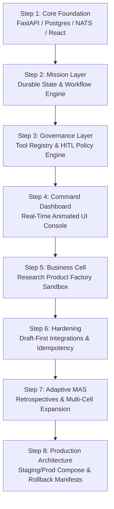

# NEXUS CAS-MAS — Enterprise Multi-Agent Operating System
### *An 8-Step Production-Hardened Autonomous Agent Platform with FastAPI, Postgres, NATS Message Streaming & Automated Rollback Manifests*

[](#the-8-step-engineering-evolution)
[](#andrews-role--radical-transparency)
[](#system-architecture--event-streaming)
[](#persistence--data-integrity)
[](#production-deployment--rollback-engine)

---

## Executive Summary

**NEXUS CAS-MAS** is an enterprise-grade autonomous agent platform architected by **Andrew Clifton**. Engineered to bridge the gap between experimental AI prototypes and mission-critical enterprise infrastructure, NEXUS is structured as a **Complex Adaptive System + Multi-Agent System (CAS-MAS)** capable of coordinating autonomous business cells while strictly preserving human governance and operational safety.

Built across an 8-step iterative engineering roadmap, the platform features a **FastAPI backend, PostgreSQL state store, NATS distributed event streaming bus, React real-time command console, and Nginx reverse proxy**.

Unlike brittle agent frameworks that execute unmonitored code directly on host systems, NEXUS enforces an uncompromising **Safety Boundary**: autonomous agents are restricted to drafting proposals, preparing deployment packets, and conducting dry-run smoke tests. Real-world execution, database migrations, and production promotions remain strictly gated behind human-operator sign-off and deterministic **Automated Rollback Manifests**.

```
                         THE NEXUS CAS-MAS ARCHITECTURE
  React UI (Port 3000) ──► [ Nginx Proxy ] ──► FastAPI Gateway (Port 8000)
                                                       │
         ┌───────────────────┬─────────────────────────┴─────────────────────────┐
         ▼                   ▼                                                   ▼
  [ NATS Streaming ] ◄──► [ PostgreSQL DB ] ◄──► [ Policy Engine ] ──► [ Rollback Engine ]
   (Port 8222 Events)      (Mission State)        (HITL Human Gate)     (Zero-Downtime Safe)
```

---

## The Enterprise Challenge: The Production Readiness Chasm in Multi-Agent AI

While hobbyist agent projects rely on single Python scripts executing random web searches, enterprise deployment requires real software engineering:
1. **The Distributed State Crisis:** As multiple agents execute concurrent tasks, file-based locks and shared memory lead to race conditions, deadlocks, and corrupted mission states.
2. **The "Rogue Action" Risk:** Allowing autonomous agents direct execution authority over production servers, billing APIs, or customer channels invites catastrophic operational failures.
3. **No Rollback Capability:** When an autonomous workflow fails midway through execution, traditional agent scripts leave orphaned database records, broken services, and no recovery path.
4. **Lack of Staging Parity:** Testing agents exclusively in production environments leads to unexpected downtime and API rate-limit starvation.

> [!IMPORTANT]
> **Core Architectural Axiom:**  
> *Agents plan; operators execute.*  
> In NEXUS CAS-MAS, no autonomous agent is ever granted write access to infrastructure, cloud credentials, or production databases. Agents generate cryptographically verifiable **Approval Packets** and dry-run telemetry; humans review and trigger deployments.

---

## Andrew's Role & Radical Transparency

This showcase demonstrates **Enterprise Software Architecture, Distributed Systems Engineering, and AI Governance**:

```
┌─────────────────────────────────────────────────────────────────────────────┐
│                      ANDREW CLIFTON — ARCHITECT & LEAD                      │
├─────────────────────────────────────────────────────────────────────────────┤
│  • Platform Architecture: Designed the 8-step modular system roadmap.       │
│  • Event Bus Design: Integrated NATS message streaming for agent events.   │
│  • Safety & HITL: Engineered the policy firewall & approval packet model.   │
│  • DevOps & Deployment: Built staging/prod Docker Compose & Nginx proxies.  │
│  • Reliability Engineering: Architected automated rollback manifests.       │
└─────────────────────────────────────────────────────────────────────────────┘
```

### What Andrew Did (The Technical Leadership):
* **Designed the 8-Phase Evolution:** Sequenced the architecture from basic API scaffolding to multi-business-cell expansion and production deployment profiles.
* **Separated Event Streams from Persistent State:** Integrated **NATS JetStream** for low-latency asynchronous agent message passing, paired with **PostgreSQL** for durable ACID mission state.
* **Engineered Deployment Approval Packets:** Designed the schema that aggregates environment diffs, smoke test dry-run logs, and rollback instructions into a single reviewable artifact.
* **Implemented Fail-Safe DevOps Automation:** Authored production bash/PowerShell runbooks (`deploy.sh`, `rollback.sh`, `backup.sh`, `smoke_test.sh`) ensuring zero-downtime recovery.

### What AI Executed:
* Synthesis of boilerplate FastAPI endpoint handlers and Pydantic validation models.
* React UI component layout rendering for the real-time command dashboard.
* Simulated agent workload generation during dry-run smoke testing.

---

## The 8-Step Engineering Evolution

NEXUS CAS-MAS was engineered through disciplined, testable milestones:



* **Steps 1–3 (The Core):** Established distributed message streaming via NATS (port 8222), relational state in PostgreSQL, and the deterministic Human-in-the-Loop policy firewall.
* **Steps 4–5 (The Operator Surface):** Deployed the React dashboard (port 3000) and initialized the first specialized business cell: the *Research Product Factory*.
* **Steps 6–7 (Resilience & Adaptability):** Enforced draft-first external integrations (no unreviewed API mutations) and added retrospective agent scoring loops.
* **Step 8 (Production Deployment Architecture):** The culmination of the build—staging/production environment registry, approval packets, automated smoke testing, and rollback manifests.

---

## Production Deployment & Rollback Engine

Step 8 transforms NEXUS into a hardened multi-environment platform:

```
┌─────────────────────────────────────────────────────────────────────────────┐
│                       DEPLOYMENT PIPELINE WORKFLOW                          │
├─────────────────────────────────────────────────────────────────────────────┤
│ 1. [Seed Envs]       ➔ Local / Staging / Production environments registered │
│ 2. [Plan Release]    ➔ Generates immutable Deployment Approval Packet        │
│ 3. [Smoke Dry-Run]   ➔ Simulates execution & verifies database migrations  │
│ 4. [Operator Review] ➔ Human reviews packet via Dashboard or CLI            │
│ 5. [Execute Deploy]  ➔ Container promotion via Nginx reverse proxy          │
│ 6. [Rollback Ready]  ➔ Pre-calculated rollback manifest executable in &lt;10s │
└─────────────────────────────────────────────────────────────────────────────┘
```

### Docker Compose Multi-Profile Setup:
* `docker-compose.yml`: Base development configuration with local hot-reloading.
* `docker-compose.staging.yml`: Staging cluster with simulated network latency and mock third-party services.
* `docker-compose.production.yml`: Production environment with hardened Nginx reverse proxy, resource clamps, and healthcheck monitors.

---

## Key Takeaways & Lessons for Technical Teams

1. **Enterprise Agents Require Message Brokers, Not Just REST APIs:** Direct HTTP calls between agents cause blocking bottlenecks. NATS event streaming provides pub/sub fan-out, replayable queues, and sub-millisecond latency.
2. **Draft-First Architecture Prevents Catastrophic API Errors:** By requiring agents to write proposals to PostgreSQL and submit an Approval Packet rather than executing direct external webhooks, operational safety is guaranteed.
3. **Rollbacks Must Be Pre-Calculated, Not Ad-Hoc:** When a release fails, you cannot wait for an LLM to generate a recovery plan. NEXUS generates deterministic rollback manifests *before* any deployment is permitted to start.
