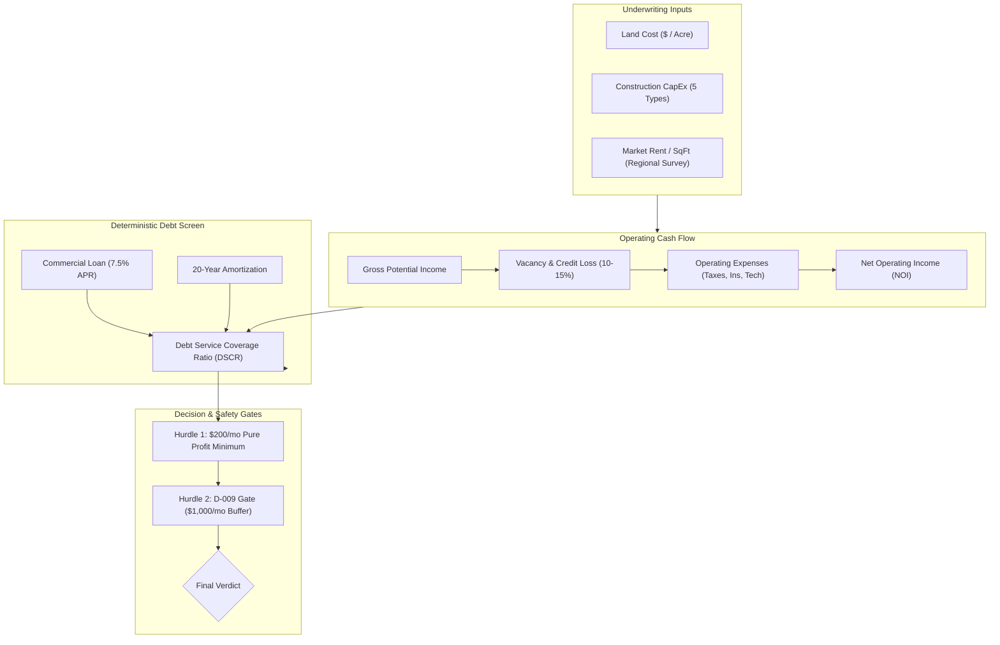

# Self-Storage Commercial Acquisition & Financial Underwriting Engine
### *A Quantitative Feasibility Model, 5-Construction Sensitivity Engine & Local RAG Legal Intelligence System*

[](#the-investment-problem--capital-protection)
[](#andrews-role--radical-transparency)
[](#financial-modeling--debt-screening)
[](#5-type-construction-tradeoff-matrix)
[](#local-rag--legal-statutory-engine)

---

## Executive Summary

The **Self-Storage Commercial Acquisition & Underwriting Engine** is a rigorous financial and operational feasibility framework created by **Andrew Clifton** to evaluate small-scale self-storage developments in Northern Arkansas (Mountain Home & Viola markets).

Confronting the high capital risks inherent in commercial real estate development, Andrew rejected optimistic "napkin math" and built a **deterministic, quantitative underwriting engine**. The system integrates a dynamic Excel sensitivity model (`self-storage-sensitivity-model.xlsx`), an equity partnership structure (`equity-partnership-model.md`), a 5-way construction cost comparison, and a **local Retrieval-Augmented Generation (RAG) system** indexing Arkansas commercial statutes and lien law.

Operating under an absolute **capital-preservation mandate** ($63,000 cash pool protected, $80,000 emergency reserve insulated, $0 personal loss tolerance), the model enforces the **D-009 Hard Pre-Spend Gate** ($1,000/month after-debt buffer). When the model revealed that standard buy-land-and-build scenarios failed this debt screen at prevailing 7.5% interest rates, the engine correctly delivered a disciplined **"DO NOT SPEND / CAPITAL PRESERVATION"** verdict, saving the family tens of thousands of dollars in premature debt commitments.

```
                     THE UNDERWRITING VALUE EQUATION
  Raw Land & Parcel ──► [ Quantitative Debt Screening ] ──► Capital Preservation
   Hypothesis           • 5 Construction Scenarios        ═════════════════════════
                        • 7.5% / 20-Yr Amortization       Prevents $60k+ Premature
                        • Hard D-009 $1,000 Gate          Capital Exposure
```

---

## The Investment Problem: The "Napkin Math" Trap in Commercial Development

Small commercial real estate is filled with catastrophic financial pitfalls for first-time developers:
1. **The Linear Math Illusion:** Promoters pitch naive math like *"20 units $\times$ \$100/mo = \$2,000 income"*, ignoring vacancy rates, property taxes, commercial insurance, software costs, and snow removal.
2. **Interest Rate Reality:** At 7.5% commercial interest over a 20-year amortization, debt service quickly devours operating margin on small unit counts.
3. **Construction Blindspots:** Builders fail to compare capital expenditure profiles across modular, shipping container, post-frame, and rigid-frame steel construction.
4. **Statutory Liens & Eviction Illusions:** Operators assume unpaid unit contents become property of the landlord on Day 31. Under Arkansas law, lien sales require strict 45+ day notice timelines, legal newspaper advertising, verified lienholder notices, and audited public auctions.

> [!IMPORTANT]
> **Core Architectural Axiom:**  
> *The highest-ROI output of an underwriting model is the discipline to say NO.*  
> A financial model that greenlights an unviable project destroys wealth; a model that proves an asset is sub-scale before a dollar is spent preserves family capital.

---

## Andrew's Role & Radical Transparency

This showcase demonstrates **Quantitative Financial Modeling, Risk Engineering, and AI-Augmented Legal Analysis**:

```
┌─────────────────────────────────────────────────────────────────────────────┐
│                      ANDREW CLIFTON — LEAD UNDERWRITER                      │
├─────────────────────────────────────────────────────────────────────────────┤
│  • Risk Architecture: Formulated D-009 $1,000 post-debt pre-spend gate.     │
│  • Quantitative Modeling: Built 5-scenario financial sensitivity models.    │
│  • Legal Engineering: Built local RAG indexing Arkansas storage statutes.  │
│  • Market Analysis: Conducted rent surveys across Mountain Home / Viola.   │
│  • Investment Decision: Enforced capital preservation over emotional spend. │
└─────────────────────────────────────────────────────────────────────────────┘
```

### What Andrew Did (The Technical Leadership):
* **Formulated Non-Negotiable Risk Limits:** Locked the family's $63,000 cash pool and $80,000 savings reserve behind a $0 loss-boundary policy, forcing the investment to justify itself strictly on debt coverage.
* **Engineered the D-009 Gate:** Established that no land acquisition, engineering contract, or equipment deposit could occur without demonstrating a \$1,000/month post-debt cash cushion.
* **Architected Local Transparent RAG:** Created standalone Python retrieval scripts (`scripts/build_rag_index.py`, `scripts/retrieve_context.py`) indexing Arkansas lien statutes and zoning ordinances without sending proprietary records to public cloud models.
* **Executed the Comparative Construction Analysis:** Quantified cost-per-square-foot and longevity trade-offs across 5 distinct building archetypes.

### What AI Executed:
* Extraction of statutory cross-references from the Arkansas Code Annotated (Title 18 Property).
* Automated formula generation for debt-service coverage ratio (DSCR) calculations in Excel.
* Plot generation for the regional rent comparison curve (`rent-comparison-analysis.png`).

---

## Financial Modeling & Debt Screening

The core financial model screens candidate parcels through a multi-variable debt matrix:



### Key Underwriting Metrics:
* **Provisional Unit Mix:** 32 units / 4,200 total rentable square feet (screening baseline).
* **Debt Screen:** 7.5% APR, 20-year term, monthly debt service benchmarked against 75% stabilized occupancy.
* **Target Hurdle:** Immediate path to \$200 monthly pure profit, stepping up to \$1,000 pre-spend buffer.

---

## 5-Type Construction Tradeoff Matrix

Andrew evaluated 5 construction methodologies to identify capital efficiency:

| Archetype | Description | CapEx / SqFt | Permitting & Zoning Friction | Lifespan / Durability | Underwriting Verdict |
|---|---|---|---|---|---|
| **1. Converted Shipping Containers** | Repurposed 20ft/40ft ISO containers | Low–Medium | High (zoning pushback in many counties) | Medium (rust, condensation risk) | Rejected for primary site |
| **2. Portable / Modular Metal** | Prefabricated bolt-down storage pods | Low | Low–Medium (classified as personal property) | Medium | Preserved for phased expansion |
| **3. Post-Frame Metal (Tin-Clad)** | Pole barn timber frame with metal skin | Low–Medium | Low (standard agricultural permit) | Medium–High | Viable rural contender |
| **4. Purpose-Engineered All-Steel** | Commercial cold-formed steel structure | Medium | Standard commercial review | High (30+ years) | Preferred long-term standard |
| **5. Steel-Kit with General Contractor** | Turnkey commercial developer package | High | Standard commercial review | High (30+ years) | Fails debt screen at sub-scale |

---

## Local RAG & Legal Statutory Engine

To ensure compliance with Arkansas lien and self-storage laws, the project uses a clean, zero-dependency Python RAG architecture:

```powershell
# Build transparent local BM25/vector index
python scripts/build_rag_index.py

# Retrieve specific statutory requirements
python scripts/retrieve_context.py "Arkansas lien sale and delinquency" --top 6

# Validate all project assumptions and state gates
python scripts/validate_project.py
```

### Key Legal Discoveries Grounded in Local Law:
* **Day 31 Fallacy Refuted:** Content ownership never automatically vests in the operator on Day 31. Under Arkansas law, delinquency procedures require minimum 45-day cure notices, publication in local county newspapers, certified mail notices to secondary lienholders, and formal public auction procedures with excess proceeds held in escrow.

---

## Key Takeaways & Lessons for Technical Teams

1. **Analytical Honesty Beats Confirmation Bias:** Andrew resisted the emotional urge to buy land and build immediately. He followed the mathematical output of his model, protecting family capital when debt conditions were unfavorable.
2. **Local RAG Provides Transparent Domain Grounding:** Instead of asking ChatGPT general questions about real estate law, indexing local statutes via a private script produced verifiable, citation-backed legal guardrails.
3. **Capital Limits Must Precede Financial Modeling:** By establishing a $0 personal loss boundary before running spreadsheet calculations, the model was forced to evaluate reality rather than hopeful assumptions.
