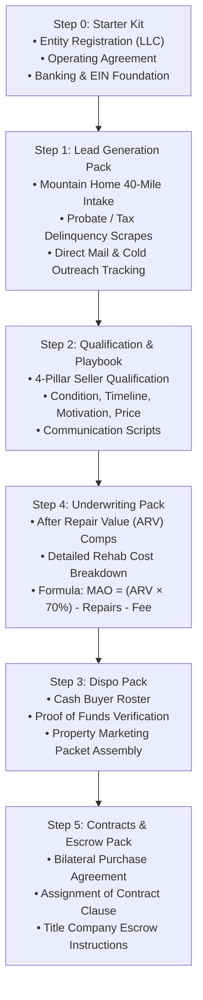

# Central Home Properties, LLC OS
### *An End-to-End Real Estate Wholesale Operations Engine & Section 8 Housing Authority SOP Platform*

[](#the-6-step-operational-pipeline)
[](#andrews-role--radical-transparency)
[](#the-6-step-operational-pipeline)
[](#section-8-housing-authority-standard-operating-procedures)
[](#underwriting--contract-mechanics)

---

## Executive Summary

**Central Home Properties, LLC OS (CHP-OS)** is an enterprise-grade real estate operations system architected by **Andrew Clifton**. Designed to transform real estate wholesaling and distressed property acquisitions from an unstructured, ad-hoc hustle into an **auditable, repeatable, and legally compliant business engine**, CHP-OS packages the complete transactional lifecycle into a 6-phase operational pipeline.

Operating across Northern Arkansas (focusing on a 40-mile radius around Mountain Home), the system provides standardized tools for **distressed lead intake, quantitative Maximum Allowable Offer (MAO) underwriting, Arkansas-compliant contract assignments, and title escrow closing**.

In addition to wholesale transaction mechanics, CHP-OS includes the **Section 8 SOP Pack v1.2**: a comprehensive operational manual for navigating the federal Housing Choice Voucher program. This pack covers everything from Request for Tenancy Approval (RFTA) submissions and Housing Quality Standards (HQS) pre-inspection checklists to rent-ceiling negotiations, providing buy-and-hold investors with guaranteed, government-backed cash-flow stabilization.

```
                    THE CENTRAL HOME PROPERTIES OS PIPELINE
  Distressed Lead ──► [ Phase 1-2: Intake & Qualification ] ──► Maximum Allowable Offer (MAO)
                             │                                             │
                             ▼                                             ▼
  Compliant Title Escrow ◄── [ Phase 5: Contract Assignment ] ◄── [ Phase 3-4: Dispo & Match ]
  (Closing & Payout)         (Arkansas Legal Package)           (Cash Buyer Network)
```

---

## The Business Problem: Operational Chaos & Legal Liability in Wholesaling

Real estate wholesaling has an extraordinarily high failure rate due to severe structural and legal mismanagement:
1. **Unregulated Contract Chaos:** Wholesalers frequently use generic internet contracts that violate state licensing laws or lack proper assignment-of-contract and inspection-period protections.
2. **Incompetent Repair Estimation:** Investors underestimate rehab costs, resulting in inflated purchase offers that cash buyers reject, leaving earnest money at risk.
3. **Chaotic Lead Tracking:** Without standardized opportunity intake forms, distressed seller data is lost across notebooks and text messages.
4. **The Section 8 Bureaucracy Barrier:** Landlords miss out on guaranteed HUD payments because they fail to navigate Housing Authority timelines, inspection requirements, and paperwork packets.

> [!IMPORTANT]
> **Core Operational Axiom:**  
> *Real estate wholesaling is not a sales tactic; it is an escrow and legal paper pipeline.*  
> Success depends on deterministic data intake, conservative underwriting math, and bulletproof title escrow management.

---

## Andrew's Role & Radical Transparency

This showcase demonstrates **Business Process Engineering, Real Estate Systems Architecture, and Regulatory Compliance**:

```
┌─────────────────────────────────────────────────────────────────────────────┐
│                      ANDREW CLIFTON — OPERATIONS ARCHITECT                  │
├─────────────────────────────────────────────────────────────────────────────┤
│  • Systems Engineering: Designed the 6-phase wholesale operational pipeline.│
│  • Underwriting Framework: Formulated conservative MAO underwriting models. │
│  • Regulatory Compliance: Authored the Section 8 SOP Pack v1.2 manual.      │
│  • Legal Packaging: Assembled Arkansas-compliant assignment & escrow packs. │
│  • Opportunity Intake: Built standardized Mountain Home 40-mile trackers.   │
└─────────────────────────────────────────────────────────────────────────────┘
```

### What Andrew Did (The Operational Leadership):
* **Designed the 6-Step SOP Architecture:** Structured the complete transaction journey from Step 0 (entity setup) through Step 5 (escrow closing).
* **Engineered the Opportunity Intake & Lead Tracker:** Built standardized intake files (`CHP_Mountain_Home_40_Mile_Opportunity_Intake_File.docx`) capturing tax parcel data, mortgage liens, seller motivation, and property physical conditions.
* **Authored the Section 8 SOP Pack v1.2:** Created an end-to-end guide detailing how to prepare units for HQS inspections (GFCI outlets, window locks, lead paint abatement) and submit RFTA packets to local Housing Authorities.
* **Standardized Legal Assignment Chains:** Curated Arkansas-compliant purchase agreements with bilateral inspection contingencies and assignability disclosures, eliminating legal friction at title companies.

---

## The 6-Step Operational Pipeline

CHP-OS divides real estate transactions into 6 modular, sequential operating packs:



---

## Underwriting & Contract Mechanics

The underwriting pack enforces the industry standard, conservative **Maximum Allowable Offer (MAO)** formula to eliminate speculative guessing:

$$\text{MAO} = (\text{ARV} \times 0.70) - \text{Estimated Repair Costs} - \text{Wholesale Fee}$$

* **After Repair Value (ARV):** Determined exclusively using closed comps within a 1-mile radius (or 5-mile rural radius in Baxter/Fulton counties) sold within the preceding 6 months.
* **Repair Estimator:** Categorized into standardized per-square-foot cost tiers (Cosmetic: \$15/sqft, Moderate: \$30/sqft, Full Gut: \$50+/sqft).
* **Escrow Safeguard:** Every contract specifies a minimum 14-day inspection contingency and clear title certification requirements handled through licensed Arkansas title companies.

---

## Section 8 Housing Authority Standard Operating Procedures

The **Section 8 SOP Pack v1.2** is a standout enterprise asset designed to unlock high-yield, recession-resistant rental portfolios:

```
┌─────────────────────────────────────────────────────────────────────────────┐
│                      SECTION 8 SOP PACK v1.2 WORKFLOW                       │
├─────────────────────────────────────────────────────────────────────────────┤
│ 1. [Voucher Intake]    ➔ Validate tenant voucher bedroom size & rent ceiling│
│ 2. [RFTA Package]      ➔ Complete HUD Form 52517 (Request for Tenancy)      │
│ 3. [HQS Pre-Audit]     ➔ Self-inspect using 28-point Housing Quality rubric  │
│ 4. [PHA Negotiation]   ➔ Benchmark fair market rents (FMR) for maximum rate │
│ 5. [Lease Execution]   ➔ Bilateral lease + HUD Housing Assistance (HAP)     │
│ 6. [Direct Deposit]    ➔ Guaranteed 1st-of-month federal electronic deposit │
└─────────────────────────────────────────────────────────────────────────────┘
```

### Key Compliance Elements Covered:
* **HQS Inspection Readiness:** Water heater pressure relief valves, window sash locks, smoke/CO detector placement, GFCI outlet grounding.
* **Rent Reasonableness Defense:** How to compile rental comps to justify top-of-market voucher payouts from local Public Housing Authorities (PHAs).

---

## Key Takeaways & Lessons for Technical Teams

1. **Systematization Eliminates Human Error:** By turning real estate deals into standardized intake forms and underwriting formulas, inexperienced operators can qualify leads without making costly emotional mistakes.
2. **Operations Manuals Are Valuable Intellectual Property:** The value of Central Home Properties OS lies in its documented, turn-key procedures. Anyone can buy a house; very few can execute a 6-phase repeatable acquisition engine.
3. **Deep Regulatory Knowledge Creates Defensible Moats:** Master of complex federal programs like Section 8 HUD vouchers provides stable, government-guaranteed revenue that competitors avoid due to paperwork friction.
