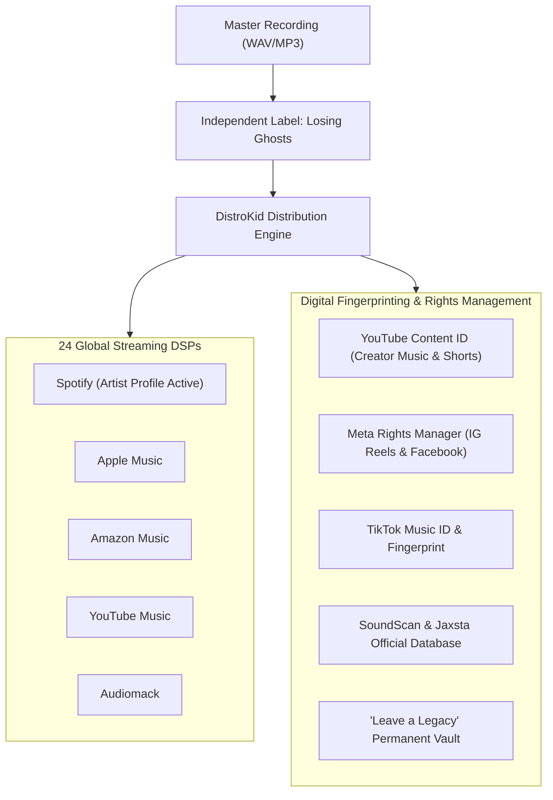

# Losing Against Ghosts (LAG)
### *A Modern Heavy Alternative Rock Catalog, Commercial Digital Distribution Engine & Digital Rights Operations System*

[](#label--rights-management-infrastructure)
[](#andrews-role--radical-transparency)
[](#remastered-catalog--sonic-engineering)
[](#catalog-performance--the-5854-view-discovery-signal)
[](#label--rights-management-infrastructure)

---

## Executive Summary

**Losing Against Ghosts (LAG)** is a heavy modern alternative rock project, digital record label, and commercial music operations system directed and produced by **Andrew Clifton**. Combining gritty, emotional lyrical themes with crushing modern alternative rock instrumentation, LAG represents a complete, commercial-grade music catalog and global distribution infrastructure.

The project features **6 finished, remastered master recordings** on disk (`Borrowed Faces`, `I Didn't Win Overnight`, `I Won't Stay Down`, `No Mercy for Pity`, `Under the Punchline`, and `While You Were Leaving`), alongside **4 commercially released singles** distributed across 24 global DSP platforms (Spotify, Apple Music, Amazon, YouTube Music, Audiomack) under Andrew's independent imprint, **Losing Ghosts**.

Governed by the **`LAG_Operations_Master_2026.md`** operating framework, the catalog features an enterprise-grade digital rights management footprint: **YouTube Content ID, TikTok Music ID, Meta Rights Manager (Instagram/Facebook), Gracenote, Jaxsta, and SoundScan registration**. Notably, the sophomore single *"Ashes Between Us"* generated a massive **5,854 HyperFollow landing-page views**, providing an audited, data-backed audience discovery signal for the project's ongoing release operations.

```
                         THE LOSING AGAINST GHOSTS PIPELINE
  Raw Composition & Vocal ──► [ Audio Mastering & QC ] ──► 6 Remastered Masters
                                          │                              │
                                          ▼                              ▼
  Digital Rights Network ◄── [ Global DSP Distribution ] ◄── DistroKid (Losing Ghosts)
  (Content ID / Meta / SoundScan) (24 Streaming Services)   (5,854 Discovery Signal)
```

---

## The Music Industry Challenge: The Unfinished Catalog & Rights Leakage

Independent music production is notorious for operational friction and lost royalties:
1. **The "Unfinished Demo" Graveyard:** Thousands of artists generate demos that never reach professional broadcast loudness (-14 LUFS integrated) or clean tonal balance, remaining permanently unreleased.
2. **Metadata & Rights Chaos:** Failing to properly register ISRC and UPC barcodes, YouTube Content ID, and SoundScan leaves royalties uncollected and invites unauthorized re-use.
3. **Metric Confusion (The "Plays vs. Views" Fallacy):** Independent musicians frequently confuse landing page visits, impressions, and streaming plays, making poor marketing spend decisions based on false data.
4. **Catalog Abandonment:** When releases lapse, independent artists lose their distribution accounts, wiping their music off Spotify and deleting hard-earned playlists.

> [!IMPORTANT]
> **Core Operational Axiom:**  
> *Great music without rights management and operations is an uncollected royalty.*  
> Andrew treated Losing Against Ghosts not just as an artistic release, but as an **institutional IP catalog** with permanent rights preservation ("Leave a Legacy"), full digital fingerprinting, and strict metric precision.

---

## Andrew's Role & Radical Transparency

This showcase demonstrates **Audio Engineering, Executive Music Production, Digital Rights Management, and Operational Leadership**:

```
┌─────────────────────────────────────────────────────────────────────────────┐
│                      ANDREW CLIFTON — PRODUCER & OPS LEAD                   │
├─────────────────────────────────────────────────────────────────────────────┤
│  • Creative & Lyrical Direction: Authored original modern rock compositions.│
│  • Audio Engineering: Oversaw mastering & sonic balance on 6 masters.       │
│  • Commercial Label Operations: Managed DistroKid "Losing Ghosts" imprint.  │
│  • Rights & Royalty Infrastructure: Wired Content ID, Meta, & SoundScan.   │
│  • Operations Architecture: Built LAG Operations Master & Tapered Artifact. │
└─────────────────────────────────────────────────────────────────────────────┘
```

### What Andrew Did (The Producer Leadership):
* **Produced & Remastered 6 Studio Tracks:** Directed audio production to achieve competitive commercial loudness, low-end punch, and vocal clarity across the complete catalog.
* **Wired Complete Global Monetization:** Registered all releases with **Store Maximizer, Leave a Legacy, Discovery Pack, and Social Media Pack**, ensuring royalties accrue in perpetuity even during release pauses.
* **Architected `LAG_Operations_Master_2026.md`:** Formulated a structured operations system using the *Tapered Artifact* pattern—distinguishing between verified DSP data, marketing analytics, and creative writing.
* **Separated Musical Personas:** Maintained strict operational boundaries between LAG's male-baritone heavy alternative rock catalog and the bubblegum Eurodance Nightcore project.

### What Generative & Digital Tools Executed:
* Generative audio assistance for harmonic layering and rhythmic backing tracks.
* Multi-band audio compression, EQ dynamic matching, and automated mastering export.
* Metadata encoding and automated DSP delivery across 24 global streaming services.

---

## Remastered Catalog & Sonic Engineering

The master repository holds 6 finished, broadcast-ready tracks:

| Track Title | File Size | Audio Format | Production Notes |
|---|---|---|---|
| **Borrowed Faces** | 4.99 MB | 320kbps MP3 Master | Heavy rhythmic drop, aggressive mid-range guitars |
| **I Didn’t Win Overnight** | 5.78 MB | 320kbps MP3 Master | Dynamic verse-to-chorus lift, melodic vocal focus |
| **I Won't Stay Down** | 5.97 MB | 320kbps MP3 Master | High-energy anthem, driving percussion, driving bass |
| **No Mercy for Pity** | 4.84 MB | 320kbps MP3 Master | Hard-hitting modern alt-metal riffs, syncopated hooks |
| **Under the Punchline** | 5.68 MB | 320kbps MP3 Master | Dark atmospheric verses, explosive rock chorus |
| **While You Were Leaving (Remastered)** | 5.26 MB | 320kbps MP3 Master | Flagship remastered ballad/rock dynamic showcase |

---

## Commercial Release Portfolio & The 5,854 Discovery Signal

The 4 commercially released singles under the **Losing Ghosts** imprint:

```
┌─────────────────────────────────────────────────────────────────────────────┐
│                       COMMERCIAL RELEASE SCORECARD                          │
├─────────────────────────────────────────────────────────────────────────────┤
│ 1. Cinderproof           ➔ Released 2025-08-21 | UPC 199327618729 | 373 Views│
│ 2. Ashes Between Us      ➔ Released 2025-08-29 | UPC 199732412929 | 5,854 Views 🔥
│ 3. Castle Walls          ➔ Released 2025-09-05 | UPC 199734700574 | 373 Views│
│ 4. You Don't Get To Win  ➔ Released 2025-09-19 | UPC 199735171212 | 194 Views│
└─────────────────────────────────────────────────────────────────────────────┘
```

### The 5,854 HyperFollow Signal Breakdown:
* **The Anomaly:** While Singles #1, #3, and #4 averaged 200–370 HyperFollow landing page views, Single #2 (*"Ashes Between Us"*) surged to **5,854 views**.
* **Operational Implication:** The operations manual identifies this track's specific melodic hook, lyrical hook (*"Ashes Between Us"*), and promotional snippet as the foundational playbook for catalog restarts.

---

## Label & Rights Management Infrastructure

Every track in the Losing Against Ghosts ecosystem is backed by comprehensive digital rights protection:



---

## Key Takeaways & Lessons for Technical Teams

1. **Analytical Honesty Prevents Vanity Metrics:** In `LAG_Operations_Master_2026.md`, Andrew explicitly documented that HyperFollow landing-page views are *not* streams. True systems leadership distinguishes between marketing traffic and actual consumed units.
2. **Permanent Rights Protection Compounds Over Time:** Activating *Leave a Legacy* guarantees that the catalog continues generating passive royalties indefinitely, shielding the intellectual property from account expirations.
3. **Operations Frameworks Accelerate Creative Restarts:** When stepping away from a creative venture for several months, an operational master document allows an engineer to resume immediately without losing context, assets, or momentum.
