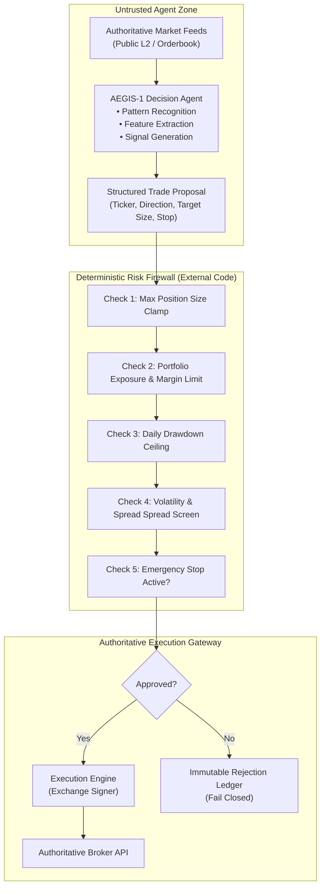

# AEGIS-1 — Autonomous Trading System & Deterministic Risk Firewall
### *A Fail-Closed, One-Agent Quantitative Execution Architecture Governed by Cryptographic Policy Records & Shadow-First Calibration*

[](#system-architecture--the-external-risk-firewall)
[](#andrews-role--radical-transparency)
[](#the-fail-closed-safety-boundary)
[](#quantitative-methodology--rp-0001-revision-b1)
[](#verification--control-validation)

---

## Executive Summary

**AEGIS-1** is a mission-critical quantitative trading system architecture designed and engineered by **Andrew Clifton**. Conceived to solve the primary catastrophe risk in algorithmic and AI trading—**uncontrolled execution loops, model hallucination of portfolio balances, and runaway drawdown**—AEGIS-1 establishes an uncompromising separation of concerns: **the agent proposes; the deterministic risk engine disposes**.

Operating under a strict **Fail-Closed Safety Posture**, AEGIS-1 isolates its single logical decision agent behind an external, programmatic risk firewall. The agent possesses zero API keys, zero order-routing authority, and zero ability to modify its own risk thresholds. 

Every trading proposal must survive **ADR-0001** (external controls), **ADR-0002** (shadow-first calibration), and **RP-0001 Revision B.1**: a rigorous statistical validation framework requiring a fixed 250-intent public shadow evaluation paired with a concurrently sealed 250-intent confirmation study, evaluating single one-sided 90% lower-bound net edges while strictly penalizing missing exits and abstentions.

```
                           THE AEGIS-1 RISK FIREWALL
  Market Ingestion ──► [ Decision Agent ] ──► Structured Trade Proposal (JSON)
                            (Untrusted)                        │
                                                               ▼
  Authoritative Broker ◄── [ Execution Gateway ] ◄── [ Deterministic Risk Firewall ]
  (Live Orders / Fills)    (Authoritative Sign)     • Max Drawdown Clamp
                                                    • Margin / Position Limit Checks
                                                    • Missing Limits FAIL CLOSED
```

---

## The Quantitative Engineering Challenge: The Fatal AI Trading Trap

Most AI and machine-learning trading bots fail catastrophically in production due to fundamental systems architecture flaws:
1. **The Self-Regulating Agent Fallacy:** Developers give AI models direct access to broker API keys and ask the model to "manage risk." During high volatility, models hallucinate positions, double down on losing bets, or fail to execute stop-losses.
2. **Backtest Overfitting & Lookahead Bias:** AI models easily find spurious patterns in historical data that completely collapse under live slippage, spread friction, and maker/taker fee regimes.
3. **Conversational Memory for Financial State:** Storing account balances, active orders, or margin levels in vector databases or LLM memory leads to catastrophic desynchronization. Authoritative balances must come exclusively from verified exchange APIs.
4. **Failure to Fail Closed:** When a network disconnect or rate-limit occurs, naive systems leave open orders floating without emergency-stop protection.

> [!IMPORTANT]
> **Core Architectural Axiom:**  
> *Risk limits must exist in deterministic software completely outside the agent's control.*  
> In AEGIS-1, missing risk limits, uncalibrated parameters, or unhandled exceptions do not default to permissive execution—they **fail closed**, instantly blocking all trading operations.

---

## Andrew's Role & Radical Transparency

This showcase demonstrates **Quantitative Systems Architecture, Risk Engineering, and Algorithmic Governance**:

```
┌─────────────────────────────────────────────────────────────────────────────┐
│                      ANDREW CLIFTON — QUANT ARCHITECT                       │
├─────────────────────────────────────────────────────────────────────────────┤
│  • System Architecture: Designed the external risk firewall & one-agent MAS.│
│  • Risk Engineering: Authored ADR-0001, ADR-0002, and fail-closed policies. │
│  • Statistical Methodology: Formulated RP-0001 Rev B.1 dual-sealed studies. │
│  • Safety Verification: Built `scripts/validate_control_state.py` audit.    │
│  • Policy Hierarchy: Established strict order of authority over models.     │
└─────────────────────────────────────────────────────────────────────────────┘
```

### What Andrew Did (The Technical Leadership):
* **Engineered ADR-0001 (External Risk Firewall):** Mandated that risk, position sizing, margin constraints, and emergency stops reside in immutable, deterministic Python code that no AI model can touch or override.
* **Formulated RP-0001 Rev B.1:** Created the mathematical evaluation protocol requiring 250 shadow intents, a sealed confirmation set, a 0.15R replay design check, and single one-sided 90% lower-bound net-edge evaluation.
* **Established the Authority Hierarchy:** Codified that signed policy files and architectural specifications permanently override any LLM output or retrieved RAG context.
* **Engineered Fail-Closed Controls:** Built `validate_control_state.py` to ensure the repository remains strictly fail-closed, with live orders, margin authority, and brokerage authentication permanently disabled until formal qualification.

### What AI Executed:
* Synthesis of mathematical statistical functions for net-edge lower-bound confidence intervals.
* Construction of pytest fixtures simulating erratic public orderbook feeds.
* Formatting of structured Pydantic trade proposal schemas.

---

## System Architecture & The External Risk Firewall

AEGIS-1 strictly segregates non-deterministic decision generation from deterministic execution:



---

## Quantitative Methodology & RP-0001 Revision B.1

To eliminate data snooping and backtest overfitting, Andrew specified **RP-0001 Revision B.1**:

```
┌─────────────────────────────────────────────────────────────────────────────┐
│                     RP-0001 REVISION B.1 PROTOCOL                           │
├─────────────────────────────────────────────────────────────────────────────┤
│ 1. [Candidate Scope Freeze] ➔ Lock feature weights, symbols, and parameters │
│ 2. [Primary Shadow Study]   ➔ 250 trade intents on live public shadow data  │
│ 3. [Concurrently Sealed]    ➔ Concurrently sealed 250-intent confirmation   │
│ 4. [Replay Design Check]    ➔ 0.15R minimum edge requirement                │
│ 5. [Statistical Rigor]      ➔ Single one-sided 90% lower-bound net edge     │
│ 6. [Adverse Imputation]     ➔ Missing exits imputed adversely (&gt;5% ceiling)│
│ 7. [Abstention Accounting]  ➔ Missing signals penalized in total score     │
└─────────────────────────────────────────────────────────────────────────────┘
```

* **Adverse Missing-Exit Imputation:** If network latency or execution slips cause a simulated trade to lose its exit timestamp, the system assumes the worst-case maximum loss of the bar. If missing exits exceed 5%, the entire study is **invalidated**.
* **Mandatory Abstention Accounting:** Strategies cannot inflate win rates by simply cherry-picking low-volatility bars; abstaining from trade windows is mathematically accounted for in net performance.

---

## The Fail-Closed Safety Boundary

The repository enforces strict, tamper-proof defaults:

| Control Surface | Live Status | Operational Rule |
|---|---|---|
| **Live Order Submission** | **DISABLED** | Hard-coded fail-closed in execution gateway |
| **Brokerage Authentication** | **DISABLED** | API key headers rejected by gateway validation |
| **Transfers & Withdrawals** | **DISABLED** | Cryptographically locked; zero withdrawal endpoints |
| **Margin & Leverage Authority** | **DISABLED** | Leverage capped at 1.0x (cash only) |
| **Loss Limits** | **FAIL CLOSED** | Any uncalibrated limit causes instant system halt |
| **State Source of Truth** | **API ONLY** | Balances and fills must never be read from LLM memory |

---

## Verification & Control Validation

The repository is validated using automated CLI controls:

```powershell
# Verify fail-closed controls and signed policy states
python scripts/validate_control_state.py

# Run comprehensive test suite across schemas and risk models
python -m pytest
```

---

## Key Takeaways & Lessons for Technical Teams

1. **AI Must Never Hold Broker Keys:** Treating LLMs as execution agents is financial negligence. AI should only produce structured proposals evaluated by deterministic code firewalls.
2. **Pre-Commit to Statistical Validation:** Without concurrently sealed confirmation studies (RP-0001), developers fall prey to curve-fitting and survivorship bias.
3. **Fail-Closed Architecture Protects Capital:** Systems must be designed so that if an unknown exception occurs, the system defaults to safety—canceling pending orders and freezing exposure.
