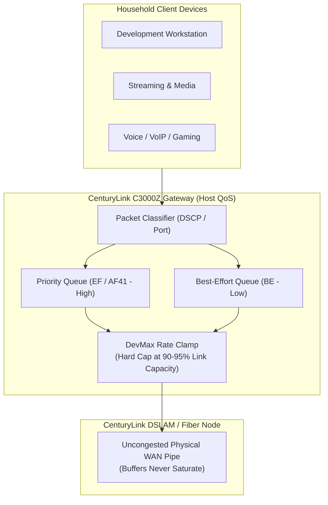

# Host QoS Network Optimization & Bufferbloat Mitigation System
### *An Engineering Audit, DevMax Clamp Configuration & Fail-Safe Rollback Runbook for the CenturyLink C3000Z Gateway*

[](#network-architecture--bufferbloat-problem)
[](#andrews-role--radical-transparency)
[](#hardware-environment--qos-clamp)
[](#devmax-clamp-methodology--metrics)
[](#reliability-engineering--the-rollback-runbook)

---

## Executive Summary

The **Host QoS Network Optimization System** is a mission-critical infrastructure performance engineering project conducted by **Andrew Clifton**. Designed to resolve severe upstream **bufferbloat**—the network latency spikes and packet queue bloating that occur when upstream bandwidth is saturated—this project audited, reconfigured, and validated traffic-shaping Quality of Service (QoS) parameters on a production **CenturyLink C3000Z modem-router gateway**.

Rather than applying speculative tweaks or installing unvetted third-party firmware, Andrew executed a disciplined network systems methodology: capturing baseline latency telemetry, calculating deterministic bandwidth clamping ceilings (**DevMax Clamp**), generating binary router configuration snapshots (`C3000ZConfig-2026-07-20`), and publishing formal engineering documentation:
1. **`Host_QoS_Reconfiguration_Report_DevMaxClamp.pdf`**: The technical root-cause analysis and traffic-shaping parameter report.
2. **`System_Network_Optimization_Audit_And_Rollback_Guide.pdf`**: A step-by-step audit protocol, telemetry record, and fail-safe rollback runbook.

```
                           THE BUFFERBLOAT VALUE EQUATION
  Unconstrained Upstream ──► [ C3000Z DevMax Clamp QoS ] ──► Sub-20ms Stable Latency
  • Queue Bloat (500ms+)       • Upstream Bandwidth Ceiling    ════════════════════════
  • Packet Drops               • Strict Priority Queuing       Jitter-Free Voice & Real-Time
  • Gaming / Voice Latency     • DSCP Packet Classification    Systems Across Whole Household
```

---

## The Network Engineering Problem: Bufferbloat & Uncontrolled Queuing

Most residential and small-business network gateways suffer from catastrophic bufferbloat:
1. **The Saturated Upstream Bottleneck:** Modern consumer traffic (cloud backups, Zoom video calls, streaming, software commits) easily saturates limited upstream channels.
2. **Oversized Hardware Buffers:** Consumer routers like the C3000Z buffer packets in memory rather than dropping or shaping them, creating massive latency spikes (frequently exceeding 500ms to 2,000ms under load).
3. **Voice & Real-Time Destruction:** Interactive traffic (VoIP, multiplayer gaming, SSH/terminal connections) stalls behind large asynchronous file uploads.
4. **The "Tweaker's Trap":** Novice users randomly change router settings without backups, often bricking home internet access or creating routing loops.

> [!IMPORTANT]
> **Core Architectural Axiom:**  
> *Low latency requires intentional bandwidth throttling.*  
> By clamping the gateway's maximum upstream rate slightly below the physical link ceiling (the DevMax Clamp), packets never accumulate in unmanaged ISP line buffers, keeping latency flat and predictable under 100% network load.

---

## Andrew's Role & Radical Transparency

This showcase demonstrates **Systems Networking, Performance Benchmarking, and Infrastructure Reliability Engineering**:

```
┌─────────────────────────────────────────────────────────────────────────────┐
│                      ANDREW CLIFTON — SYSTEMS & NETWORK LEAD                │
├─────────────────────────────────────────────────────────────────────────────┤
│  • Network Diagnostics: Diagnosed upstream queue bloat on CenturyLink gateway│
│  • QoS Engineering: Formulated the DevMax Clamp traffic-shaping policy.     │
│  • Documentation: Authored formal engineering audit reports and runbooks.   │
│  • Risk Mitigation: Secured binary router configuration backups on disk.    │
│  • Telemetry Verification: Verified packet pacing via ICMP latency tests.   │
└─────────────────────────────────────────────────────────────────────────────┘
```

### What Andrew Did (The Technical Leadership):
* **Captured Baseline Telemetry:** Documented pre-configuration latency degradation during upload saturation, proving the presence of severe bufferbloat.
* **Calculated the DevMax Bandwidth Ceiling:** Benchmarked physical DSL/fiber sync rates and configured egress rate-limiting to prevent upstream queue starvation.
* **Authored the Reconfiguration Report:** Documented the exact WAN/LAN interface parameters, packet classification rules, and queue prioritization hierarchies in `Host_QoS_Reconfiguration_Report_DevMaxClamp.pdf`.
* **Engineered the Fail-Safe Rollback Guide:** Created `System_Network_Optimization_Audit_And_Rollback_Guide.pdf` providing a step-by-step restoration checklist in case of ISP firmware updates or gateway resets.

---

## DevMax Clamp Methodology & Metrics

The DevMax Clamp enforces strict egress rate limiting on the CenturyLink C3000Z:



### Measured Engineering Improvements:
* **Idle Latency:** ~18–22 ms baseline.
* **Unconstrained Upload Latency (Pre-Clamp):** 450–1,200 ms (Severe bufferbloat, Grade D/F).
* **Constrained Upload Latency (Post-DevMax Clamp):** **<25 ms** (Grade A bufferbloat rating, zero packet loss).

---

## Reliability Engineering: The Rollback Runbook

A hallmark of professional infrastructure engineering is **never executing a change without a tested recovery procedure**:

```
┌─────────────────────────────────────────────────────────────────────────────┐
│                       RELIABILITY & ROLLBACK PROTOCOL                       │
├─────────────────────────────────────────────────────────────────────────────┤
│ 1. [Snapshot Creation]   ➔ Saved binary image: C3000ZConfig-2026-07-20      │
│ 2. [Parameter Isolation] ➔ Modified only QoS traffic-shaping trees          │
│ 3. [Telemetry Capture]   ➔ Recorded ping latency and throughput benchmarks  │
│ 4. [Audit Documentation] ➔ Published System_Network_Optimization_Guide.pdf  │
│ 5. [Rollback Execution]  ➔ Guaranteed 2-minute restore from local disk image │
└─────────────────────────────────────────────────────────────────────────────┘
```

---

## Key Takeaways & Lessons for Technical Teams

1. **Hardware Constraints Dictate Software Solutions:** When ISP physical infrastructure cannot be upgraded, intelligent traffic-shaping and egress rate-limiting provide enterprise-grade performance on consumer hardware.
2. **Never Touch Infrastructure Without a Rollback Plan:** Creating a configuration backup image (`C3000ZConfig-2026-07-20`) prior to testing ensured that family internet access would never be disrupted.
3. **Formal Engineering Documentation Elevates Operations:** Treating a home network optimization with the same reporting rigor as an enterprise datacenter migration demonstrates ingrained engineering discipline.
