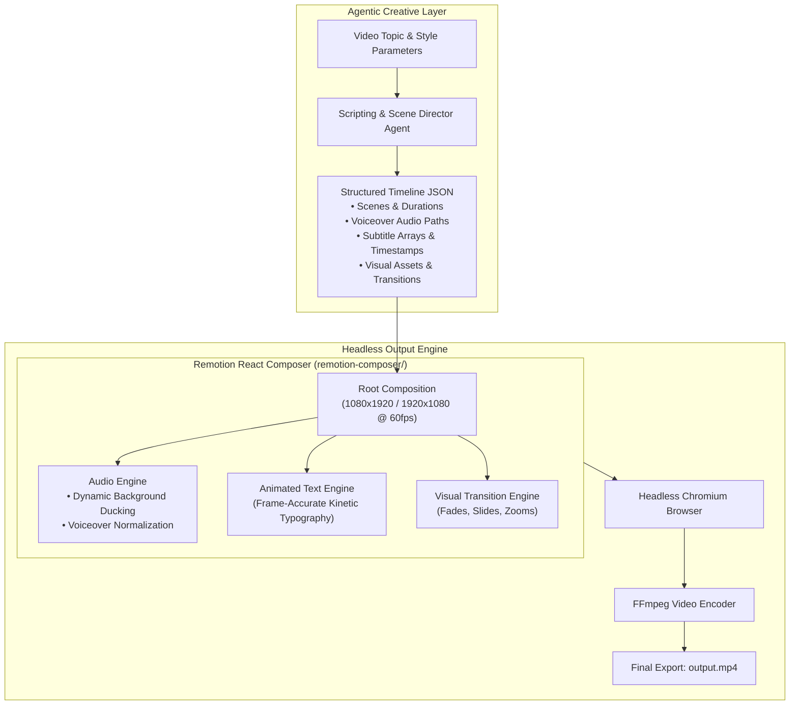

# OpenMontage — Agentic Video Production Engine & Programmatic Remotion Composer
### *An Open-Source, Code-Driven Video Generation Framework Combining LLM Agents with React-Based Frame-Accurate Rendering*

[](#remotion-composer--render-pipeline)
[](#andrews-role--radical-transparency)
[](#agentic-orchestration--prompt-gallery)
[](#rendering-pipeline--demo-automation)
[](#internationalization--community)

---

## Executive Summary

**OpenMontage** is a cutting-edge open-source agentic video production engine architected by **Andrew Clifton**. Engineered to eliminate the tedious manual timeline editing required in traditional desktop video suites (Premiere, Final Cut), OpenMontage unifies **autonomous AI scripting agents with Remotion—a React-based framework that renders videos programmatically using web code**.

By treating video as **declarative code and structured JSON schemas**, OpenMontage enables AI models to write scripts, select background music, generate scene image assets, and schedule frame-accurate transitions without human timeline dragging.

The repository includes a comprehensive **40KB Agent Guide (`AGENT_GUIDE.md`)**, an internationalized documentation suite (English and Simplified Chinese), a dedicated **Remotion Composer (`remotion-composer/`)**, and headless automated rendering scripts (`render_demo.py`, `render-demo.sh`), establishing an end-to-end framework for generative video automation.

```
                         THE OPENMONTAGE PIPELINE
  Creative Concept / Topic ──► [ AI Scripting Agent ] ──► Structured Timeline (JSON)
                                                                 │
                                                                 ▼
  Final Broadcast MP4 Video ◄── [ Remotion React Engine ] ◄── [ Asset Assembler ]
  (Frame-Accurate 60 FPS)      (Headless Chromium Render)    (Images, Audio, Captions)
```

---

## The Video Production Problem: The "Timeline Dragging" Bottleneck

Modern digital content creation demands high-volume, high-quality video, but traditional production workflows do not scale:
1. **The Desktop NLE Chasm:** Video editing software (Premiere Pro, DaVinci Resolve) requires human editors to manually cut clips, align audio tracks, and position subtitles for hours.
2. **Brittle Generative Video:** Direct text-to-video AI models (Sora, Runway) generate isolated 5-second clips that cannot be reliably stitched together with consistent typography, audio ducking, and branding.
3. **No Version Control for Video:** Binary project files (`.prproj`) cannot be git-diffed, reviewed in pull requests, or integrated into automated CI/CD pipelines.
4. **Resolution & Audio Desynchronization:** Combining AI voiceovers with background tracks manually often leads to volume clashes and misaligned captions.

> [!IMPORTANT]
> **Core Architectural Axiom:**  
> *Video should be compiled like software, not edited like tape.*  
> Remotion treats video frames as React components rendered across a timeline. By compiling structured JSON timelines into React compositions, video production becomes deterministic, version-controlled, and instantly regenerable.

---

## Andrew's Role & Radical Transparency

This showcase demonstrates **Creative Technologist Leadership, Developer Tooling Architecture, and Open-Source Systems Design**:

```
┌─────────────────────────────────────────────────────────────────────────────┐
│                      ANDREW CLIFTON — ARCHITECT & LEAD                      │
├─────────────────────────────────────────────────────────────────────────────┤
│  • System Architecture: Coupled autonomous AI agents with Remotion React.   │
│  • Developer Experience: Authored 40KB `AGENT_GUIDE.md` & prompt galleries. │
│  • Pipeline Engineering: Built Python headless render automation scripts.  │
│  • Multi-Agent Tooling: Standardized configs across Cursor, Windsurf, Claude│
│  • Internationalization: Structured bilingual repo docs (English & Chinese).│
└─────────────────────────────────────────────────────────────────────────────┘
```

### What Andrew Did (The Technical Leadership):
* **Architected the Agent-to-Video Bridge:** Designed strongly typed JSON schemas that decouple high-level AI scriptwriting from low-level React rendering components.
* **Authored the 40KB Agent Guide:** Created exhaustive developer documentation instructing autonomous coding assistants on how to build scenes, manage audio stems, and avoid frame-drop bugs.
* **Engineered the Render Automation:** Built `render_demo.py` and `render-demo.sh` to execute headless Chromium rendering runs via CLI with progress telemetry.
* **Standardized Multi-Agent Configurations:** Configured uniform rule environments across Claude, Cursor, Windsurf, and GitHub Copilot to prevent model drift during team development.

### What AI Executed:
* Programmatic React component layout rendering for animated text overlays and transitions.
* Natural language prompt generation for background B-roll image diffusion.
* Bilingual translation of technical documentation into Simplified Chinese.

---

## Remotion Composer & Render Pipeline

OpenMontage executes video rendering in a 4-phase compilation pipeline:



---

## Agentic Orchestration & Prompt Gallery

A standout feature of OpenMontage is its **Prompt Gallery (`PROMPT_GALLERY.md`)** and **Agent Guide (`AGENT_GUIDE.md`)**:
* **Structured Scene Schemas:** Guides agents on how to construct modular video scenes using Pydantic models.
* **Audio Ducking Rules:** Standardizes audio volume curves—reducing background music volume by 18dB whenever speech audio is detected.
* **Kinetic Typography:** Encodes word-level timestamping, allowing Remotion to highlight spoken words dynamically as audio plays.

---

## Rendering Pipeline & Demo Automation

To compile videos without a GUI, OpenMontage provides zero-touch CLI runners:

```powershell
# Run headless Python demo render
python render_demo.py --config config.yaml

# Execute shell render script
bash render-demo.sh
```

The script monitors frame compilation, checks for missing audio assets, and validates that video output complies with YouTube Shorts / TikTok aspect ratios (9:16) or standard landscape (16:9).

---

## Key Takeaways & Lessons for Technical Teams

1. **Code-Driven Video Scales Infinitely:** Replacing manual video editors with React-based code allows platforms to generate thousands of personalized, high-fidelity videos programmatically.
2. **Comprehensive Documentation Empowers AI Assistants:** The 40KB `AGENT_GUIDE.md` acts as a deterministic prompt anchor, allowing any LLM to immediately understand how to work inside the repository without hallucinating bad Remotion syntax.
3. **Declarative Timelines Enable True CI/CD for Media:** By storing video timelines as JSON files, media projects can be version-controlled, tested, and automatically rendered on pull request merge.
